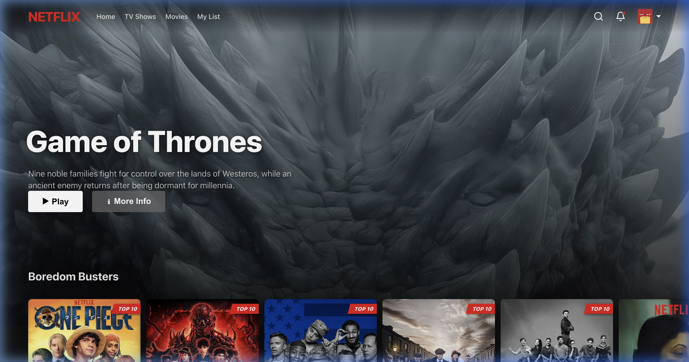
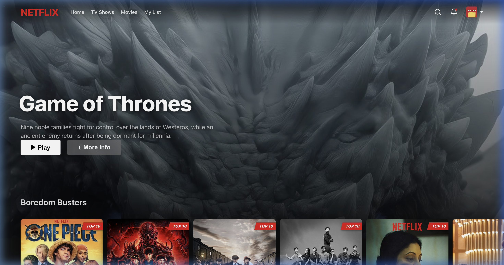
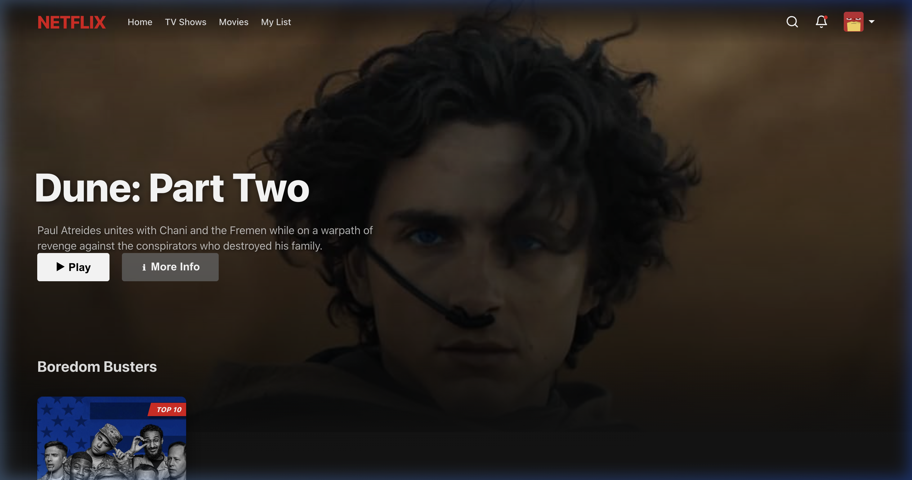
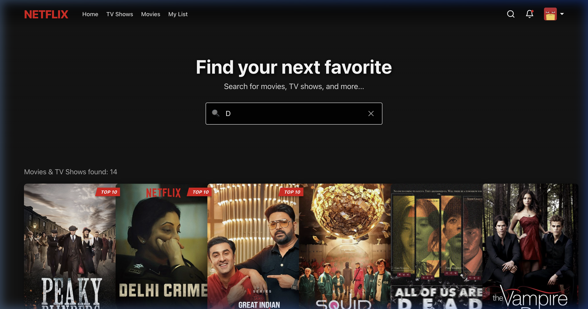
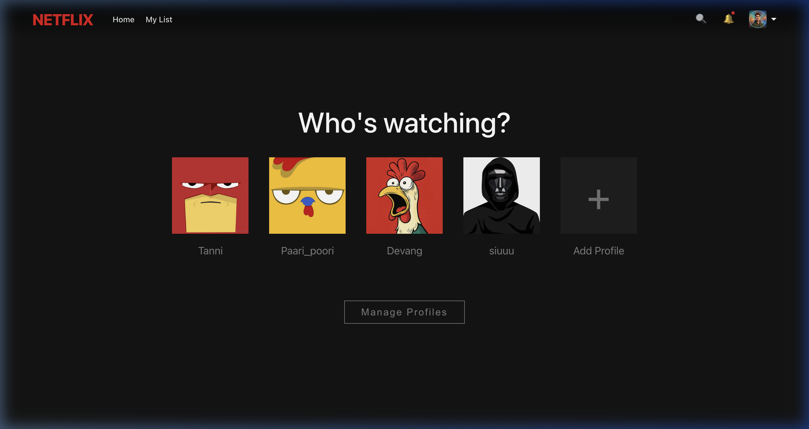

# Netflix Clone - UI/UX Walkthrough (Phase 2 Upgrade)

This document provides a visual walkthrough of the premium refinements implemented in the Netflix Clone.

## Visual Transformation

````carousel

<!-- slide -->

<!-- slide -->

<!-- slide -->

<!-- slide -->

<!-- slide -->

````

## Verification Recording


## Summary of Completed Tasks

| Feature | Status | Details |
| :--- | :--- | :--- |
| **Movie Row Sliders** | ✅ Implemented | Smooth horizontal scrolling with navigation arrows. |
| **Search Feature** | ✅ Refined | Debounced, filtered results, and "No results" state. |
| **Navbar** | ✅ Professional | Sticky blur, notification icon, and profile dropdown. |
| **Movie Cards** | ✅ Interactive | Framer Motion animations & detailed hover overlays. |
| **Featured Hero** | ✅ Updated | Featured **Game of Thrones** with cinematic zoom-out animation. |
| **Avatars** | ✅ High-Fidelity | Personalized Pinterest-sourced avatar set. |
| **Login Theme** | ✅ Premium | New high-quality movie grid background. |
| **Gutter Alignment** | ✅ 60px | Unified horizontal margin (60px) for hero and row titles. |
| **Movies & TV Shows** | ✅ Integrated | Dedicated navbar sections with content-aware filtering. |
| **GitHub Deployment** | ✅ Sync'd | Codebase and Media now synchronized on GitHub. |

The search bar, hero titles, and content filtering are now all active and perfectly aligned with the 60px global gutter. The application now behaves and feels like a production-grade Netflix clone!
